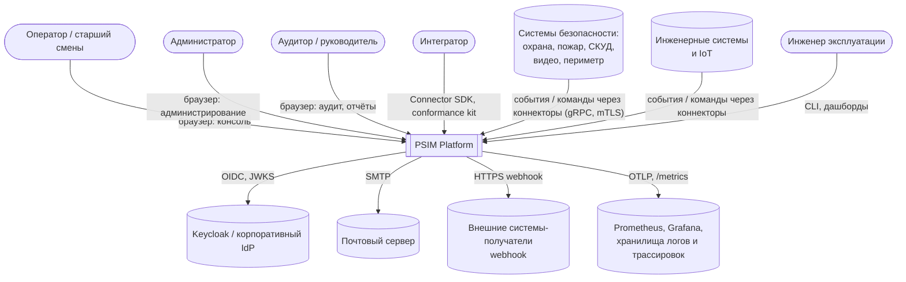
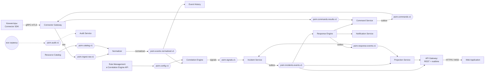
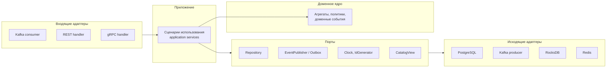

# Архитектура PSIM Platform (arc42)

Версия 0.1 · Шаг плана 0.3 · Статус: черновик

Документ построен по шаблону arc42. Крупные разделы вынесены в отдельные файлы:

| Раздел arc42 | Где |
|---|---|
| 1. Введение и цели | этот документ |
| 2. Ограничения | этот документ |
| 3. Контекст и границы | этот документ, C4 L1 |
| 4. Стратегия решения | этот документ |
| 5. Представление строительных блоков | этот документ, C4 L2-L3 |
| 6. Представление времени выполнения | [runtime-view.md](runtime-view.md) |
| 7. Представление развёртывания | [deployment.md](deployment.md) |
| 8. Сквозные концепции | [crosscutting.md](crosscutting.md) |
| - Потоки данных и семантика доставки | [data-flows.md](data-flows.md) |
| - Масштабирование и партиционирование | [scaling.md](scaling.md) |
| 9. Архитектурные решения | [реестр ADR](../psim-mvp-development-plan.md#18-реестр-adr), оформляются в шаге 0.4 |
| 10. Требования к качеству и бюджет задержек | [quality.md](quality.md) |
| 11. Риски и технический долг | этот документ |
| 12. Глоссарий | [glossary.md](../domain/glossary.md) |

Модель C4 как код: [c4/workspace.dsl](c4/workspace.dsl) (Structurizr DSL). Диаграммы в этом документе - упрощённые представления той же модели для чтения без инструментов.

---

## 1. Введение и цели

### 1.1 Назначение

Платформа реализует сквозной контур: событие от любого источника -> нормализация -> корреляция -> инцидент -> сценарий реагирования -> команды на устройства -> закрытие -> аудит и отчётность. Подробности - в [product brief](../product/product-brief.md) и [границах MVP](../product/mvp-scope.md).

### 1.2 Цели качества

Пять главных целей в порядке приоритета. При конфликте выигрывает цель с меньшим номером.

| № | Цель | Мера | Сценарии качества |
|---|---|---|---|
| QG1 | **Корректность доставки** | 0 потерь событий и инцидентов, 0 дубликатов инцидентов при любых сбоях | QS-A1..A4 |
| QG2 | **Своевременность** | Событие -> инцидент в консоли p99 ≤ 1 с при 50 000 событий/с | QS-P1..P4 |
| QG3 | **Доступность** | RTO ≤ 60 с, RPO = 0 в кластере; обновление без простоя | QS-A5, QS-O1 |
| QG4 | **Модифицируемость** | Новый источник и новая логика реакции без изменения ядра | QS-M1..M3 |
| QG5 | **Безопасность** | Аутентификация каждого входа, минимальные привилегии, неизменяемый аудит | QS-S1..S3 |

Сценарии качества - в [quality.md](quality.md).

### 1.3 Заинтересованные стороны

| Сторона | Ожидания от архитектуры |
|---|---|
| Владелец продукта | Предсказуемый объём MVP, масштаб от одной машины до кластера одной поставкой |
| Ведущий инженер и ИИ-агент | Модули с явными границами, которые можно разрабатывать и тестировать изолированно; воспроизводимое окружение |
| Интегратор | Стабильный документированный протокол коннекторов и SDK |
| Эксплуатация заказчика | Понятные топологии, наблюдаемость, runbook, обновления без простоя |
| Служба безопасности заказчика | On-premise, шифрование, аудит, модель угроз |

---

## 2. Ограничения

### 2.1 Технические

| Ограничение | Источник |
|---|---|
| Сервер на C++23: Boost.Asio и Beast, librdkafka, libpq, OpenSSL 3, gRPC и Protobuf | Решение 0.1 плана |
| Apache Kafka (KRaft) - центральная шина во всех топологиях | Решение 0.1 плана |
| PostgreSQL 16+, Redis-совместимое хранилище | Решение 0.1 плана; выбор реализации Redis - ADR-015 |
| Keycloak как Identity Provider (OIDC) | Решение 0.1 плана |
| Веб-клиент: React 19, TypeScript, Vite | Решение 0.1 плана |
| Debian 12+, Astra Linux 1.8+; поставка on-premise | Решение 0.1 плана |
| Только компоненты с открытыми лицензиями, допускающими поставку в составе коммерческого продукта on-premise | Поставка заказчикам; проверяется в CI (шаг 1.3) |
| Kubernetes вне MVP | Решение Q1 |

### 2.2 Организационные

- Один инженер и ИИ-агент: архитектура должна позволять развивать сервисы по одному, с независимыми тестами; общий код - в библиотеках платформы.
- Монорепозиторий, документация как код, ADR на каждое значимое решение.

### 2.3 Соглашения

- Именование топиков: `psim.<домен>.<сущность>.v<N>`.
- REST: OpenAPI 3.1, ошибки по RFC 9457, курсорная пагинация.
- Время - UTC, микросекунды; идентификаторы - UUIDv7 или именные UUID ([aggregates.md](../domain/aggregates.md#01-идентификаторы)).
- Язык кода и контрактов - английский; язык документации - русский; интерфейс - ru и en.

---

## 3. Контекст и границы (C4 L1)

| Внешний участник | Интерфейс | Направление |
|---|---|---|
| Коннекторы внешних систем | gRPC поверх TLS 1.3 с mTLS; протокол коннекторов v1 | двунаправленный поток: события -> платформа, команды -> коннектор |
| Браузер пользователя | HTTPS: REST v1, WebSocket realtime; статика веб-приложения | двунаправленный |
| Keycloak | OIDC Authorization Code + PKCE для пользователей; client credentials для сервисов; JWKS для проверки токенов | платформа -> Keycloak |
| Почтовый сервер | SMTP с STARTTLS | платформа -> SMTP |
| Получатели webhook | HTTPS POST с подписью HMAC | платформа -> получатель |
| Наблюдаемость | OTLP (gRPC) для трассировок, логов и метрик; HTTP `/metrics` для Prometheus | платформа -> стек наблюдаемости |

Стек наблюдаемости поставляется вместе с платформой, но заказчик может направить OTLP в свою систему.

---

## 4. Стратегия решения

| Задача | Подход | Почему |
|---|---|---|
| 50 000 событий/с и рост до миллионов | Конвейер потоковой обработки на Kafka с партиционированием по ключу; каждый этап - масштабируемая группа потребителей | Горизонтальное масштабирование без перепроектирования; порядок в пределах ключа |
| 0 потерь и дубликатов | Подтверждение коннектору после `acks=all`; детерминированные идентификаторы; exactly-once транзакции Kafka в корреляции; transactional outbox и inbox на границах PostgreSQL | Корректность в каждом звене, а не «в среднем»; проверяется симуляцией |
| Задержка ≤ 1 с | Бюджет задержек по этапам; горячий путь без синхронных межсервисных вызовов; локальные копии каталога; realtime-канал читает изменения инцидентов из Kafka напрямую | Каждый этап измерим и имеет порог |
| Корреляция с состоянием на C++ без готового фреймворка | Собственный движок: состояние в RocksDB с changelog-топиком, партиции как единицы параллелизма, event time и водяные знаки | Аналог модели Kafka Streams, адаптированный под C++; риск снимается в ходячем скелете |
| Модифицируемость | Вендор-нейтральный протокол коннекторов; декларативные правила отображения, корреляции и сценарии; гексагональная архитектура | Новые источники и реакции - конфигурация, не код ядра |
| Воспроизводимость | Kafka как журнал истины; read-модели перестраиваются проигрыванием; пробный прогон правил на истории | «Машина времени» для разбора и проверки правил |
| Тестируемость | Детерминированное доменное ядро: время, случайность и ввод-вывод за портами; симуляционный стенд | Ошибки распределённого поведения воспроизводятся по зерну |
| Одна поставка для всех масштабов | Одинаковые образы и бинарники; топологии различаются конфигурацией и числом экземпляров | Нет отдельной «лёгкой» редакции |
| Эксплуатация | Наблюдаемость с первого шага: OTLP-трассировка через Kafka-заголовки, золотые сигналы, бизнес-метрики | Отказ виден и имеет runbook |

---

## 5. Строительные блоки

### 5.1 Уровень 2: контейнеры

| Контейнер | Технология | Ответственность | Хранилище | Масштабирование |
|---|---|---|---|---|
| Connector Gateway | C++, gRPC | Сессии коннекторов, mTLS, валидация, кредиты, запись в Kafka, доставка команд | Redis: реестр сессий | Без состояния; N экземпляров за балансировщиком L4 |
| Resource Catalog | C++, REST | Локации, устройства, источники, коннекторы, импорт, планы | PostgreSQL | 1-2 экземпляра (не на горячем пути) |
| Normalizer | C++ | Отображение, обогащение, дедупликация, DLQ | Локальная копия каталога в памяти; окно дедупликации в памяти с восстановлением из Kafka | По партициям `psim.ingest.raw.v1` |
| Event History | C++ | Запись значимых событий, поиск | PostgreSQL, секции по суткам | По партициям `psim.events.normalized.v1` |
| Correlation Engine | C++ | Правила, окна, состояние, сигналы; API управления правилами и пробного прогона | RocksDB + changelog; PostgreSQL для правил | По партициям `psim.events.normalized.v1` |
| Incident Service | C++, REST | Агрегат инцидента, группировка, назначение, хронология | PostgreSQL + inbox + outbox | По партициям `psim.signals.v1`; запросы пользователей - любой экземпляр |
| Response Engine | C++, REST | Сценарии, запуски, SLA и таймеры, эскалации | PostgreSQL + outbox | По партициям `psim.incidents.events.v1`; таймеры распределены по тем же партициям |
| Command Service | C++, REST | Жизненный цикл команд, подтверждения, таймауты | PostgreSQL + outbox | 2+ экземпляра |
| Notification Service | C++ | Каналы in-app, email, webhook; повторы, агрегация | PostgreSQL | 1-2 экземпляра |
| Projection Service | C++ | Лента, состояние объектов и устройств, загрузка операторов, отчётные агрегаты | Redis (горячее), PostgreSQL (запросы) | По партициям входных топиков |
| Audit Service | C++, REST | Цепочка хэшей, контрольные точки, проверка, поиск | PostgreSQL, только добавление | 1 активный на тенант (цепочка последовательна) + резерв |
| API Gateway | C++, Beast | REST v1, WebSocket realtime, JWT, ABAC, лимиты, маршрутизация | Redis: лимиты | Без состояния; N экземпляров |
| Web Application | React, TypeScript | Консоль оператора, администрирование, аудит, отчёты | - | Статика за API Gateway или веб-сервером |
| Admin CLI | C++ | Диагностика, DLQ, перестроение проекций, проверка аудита | - | - |

Инфраструктура: Kafka (KRaft), Schema Registry (ADR-003), PostgreSQL, Redis-совместимое хранилище, Keycloak, OpenTelemetry Collector, Prometheus, Grafana, хранилища логов и трассировок.

**Управление правилами** размещено в Correlation Engine как отдельный REST-модуль, а не в отдельном сервисе: правила и движок меняются вместе, а это экономит один сервис в MVP. Модуль работает в любом экземпляре и публикует активный набор в `psim.config.v1`.

**Сервис таймеров** - библиотека платформы, а не отдельный сервис. Таймеры хранятся в PostgreSQL сервиса-владельца (Response Engine, Command Service) и обслуживаются экземпляром, владеющим партицией ключа. Подробности - ADR-012.

### 5.2 Уровень 3: компоненты ключевых сервисов

Все сервисы построены одинаково по гексагональной схеме:

Правило: доменное ядро - отдельная библиотека CMake без зависимостей от инфраструктурных библиотек и системных часов; проверяется fitness function.

#### Correlation Engine

| Компонент | Ответственность |
|---|---|
| Partition Worker | Один на назначенную партицию: чтение пакета, обработка, транзакция Kafka |
| Rule Evaluator (домен) | Чистая функция `(state, event, rules, now) -> (state', signals)` для каждого вида правил |
| State Store | Порт состояния; адаптер RocksDB с записью изменений в changelog в той же транзакции |
| Watermark Tracker | Водяные знаки по партициям и источникам; таймеры окон по event time |
| RuleSet Loader | Читает `psim.config.v1`, компилирует набор, атомарно переключает на границе смещения |
| Repartitioner | Для правил с ключом площадки: публикует отфильтрованные события в `psim.correlation.repartition.v1` ([scaling.md](scaling.md#3-корреляция-и-ключи)) |
| Rule Management API | CRUD, валидация, пробный прогон, активация набора |
| Dry-run Runner | Прогон правила по историческому диапазону `psim.events.normalized.v1` в изолированном хранилище состояния |

#### Incident Service

| Компонент | Ответственность |
|---|---|
| Signal Consumer | Пакетное чтение сигналов; транзакция БД: inbox + изменение агрегата + outbox; фиксация смещения после коммита |
| Incident Aggregate (домен) | Инварианты I1-I10, модель состояний |
| Grouping Policy (домен) | Выбор: присоединить к открытому или создать новый |
| Command API | REST-команды пользователей с ETag и ключами идемпотентности |
| Response Events Consumer | Обновление `blocking_steps` и хронологии по событиям Response |
| Outbox Relay | Публикация outbox в `psim.incidents.events.v1` и `psim.audit.v1` |

#### Connector Gateway

| Компонент | Ответственность |
|---|---|
| gRPC Server | TLS-терминирование, mTLS, двунаправленные потоки |
| Session Manager | Модель состояний сессии, heartbeat, вытеснение, регистрация в Redis |
| Ingest Pipeline | Валидация схемы и принадлежности источника, кредиты, пакетная запись в Kafka, подтверждение после `acks=all` |
| Catalog View | Локальная копия коннекторов и источников из `psim.catalog.v1` |
| Command Dispatcher | Чтение `psim.commands.v1`, доставка в локальную сессию, запись результатов |

---

## 9. Архитектурные решения

Реестр - раздел 18 [плана](../psim-mvp-development-plan.md#18-реестр-adr); оформление - шаг 0.4. Решения, принятые на шагах 0.2-0.3, которые ADR должны зафиксировать, включая отличия от плана:

| Решение | Где описано | ADR |
|---|---|---|
| Normalizer работает с exactly-once (транзакции Kafka), а не at-least-once; трекер источников в `psim.normalizer.state.v1` | [data-flows.md](data-flows.md#32-нормализация-psimingestrawv1--psimeventsnormalizedv1) | ADR-006 |
| Ключ `psim.signals.v1` - `grouping_key`, а не `correlation_key` | [data-flows.md](data-flows.md#33-корреляция-psimeventsnormalizedv1--psimsignalsv1) | ADR-007 |
| Перераспределение для правил с ключом шире зоны через `psim.correlation.repartition.v1` | [scaling.md](scaling.md#3-корреляция-и-ключи) | ADR-007, ADR-009 |
| «Эскалирован» - ортогональный уровень, «ложный» - решение, а не состояния инцидента | [state-models.md](../domain/state-models.md#1-инцидент) | новый ADR-027 |
| Жизненный цикл команд и уведомлений публикуется в `psim.response.events.v1` | [data-flows.md](data-flows.md#35-реагирование-psimresponseeventsv1) | ADR-006 |
| Команды читаются всеми экземплярами шлюза широковещательно; быстрый отказ по реестру сессий | [data-flows.md](data-flows.md#36-команды-psimcommandsv1-и-psimcommandsresultsv1) | ADR-018 |
| Realtime: снимок из проекций со смещениями + дельты напрямую из Kafka | [crosscutting.md](crosscutting.md#9-realtime-снимок-и-дельты) | ADR-019 |
| Сервис таймеров - библиотека, таймеры у сервиса-владельца | раздел 5.1 | ADR-012 |
| Управление правилами - модуль Correlation Engine | раздел 5.1 | ADR-001 |
| PostgreSQL HA: Patroni + etcd, синхронная реплика | [deployment.md](deployment.md#3-топология-кластер-на-vm) | ADR-023 |
| REST DTO и сериализация JSON в C++ | [crosscutting.md](crosscutting.md#14-синхронное-api-между-веб-клиентом-и-сервисами) | новый ADR-026 |
| Составной ключ каталога `resource_type:resource_id` | [data-flows.md](data-flows.md#37-каталог-psimcatalogv1) | ADR-007 |

---

## 11. Риски и технический долг

Риски проекта - в разделе 20 [плана](../psim-mvp-development-plan.md#20-риски). Архитектурные риски, выявленные на этом шаге:

| Риск | Влияние | Мера | Где снимается |
|---|---|---|---|
| Задержка коммита транзакций Kafka в корреляции съедает бюджет 100 мс | Нарушение QS-P2 | Интервал коммита 20-50 мс, замер в скелете; при необходимости - уменьшение пакета | 3.1, 5.2 |
| Восстановление состояния корреляции дольше 30 с | Нарушение RTO | Ограничение окна правил (R3), компактный формат состояния; резервные реплики состояния как опция | 5.2, 10.2 |
| Последовательная цепочка аудита на тенант - узкое место | Задержка аудита | Аудит не на горячем пути событий: только действия субъектов и изменения агрегатов; пакетная запись | 6.4 |
| Широковещательное чтение команд всеми экземплярами шлюза | Рост нагрузки при большом числе экземпляров | Объём команд мал; при росте - маршрутизация по реестру сессий (ADR-018) | 4.2 |
| Объём хранения Kafka при длительном retention | Стоимость дисков | Сжатие zstd, retention по уровням, модель сайзинга | 10.1 |
| Готовые C++-клиенты для Schema Registry отсутствуют | Объём работ ядра | Тонкий собственный клиент с кэшем, только нужные операции | 2.3 |
