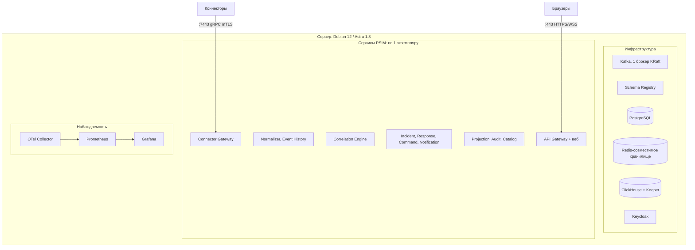
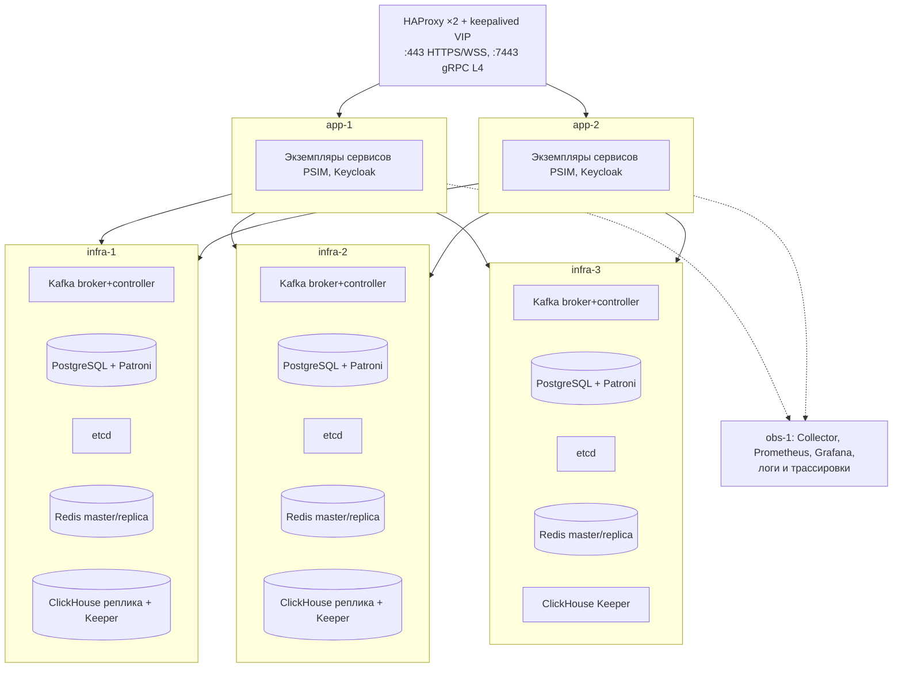

# Представление развёртывания

Версия 0.1 · Шаг плана 0.3 · Статус: черновик

Раздел 7 arc42. Топологии MVP: одна машина и кластер на VM. Kubernetes вне MVP (X15), но образы готовы к нему: без root, конфигурация через файлы и переменные, health-эндпоинты, корректная остановка по `SIGTERM`. Решения - ADR-023 и ADR-024; реализация - шаги 9.1 и 9.2.

---

## 1. Артефакты поставки

| Артефакт | Содержимое |
|---|---|
| Контейнерные образы | Один образ на сервис; минимальная база; пользователь без root; подпись и SBOM |
| Пакеты `.deb` | Бинарники сервисов, systemd-юниты, конфигурация по умолчанию - для установки без контейнеров на Debian и Astra Linux |
| Веб-приложение | Статические файлы, раздаются API Gateway или веб-сервером |
| Установщик | Проверка предусловий, генерация конфигурации по профилю топологии, создание топиков и схем БД, загрузка realm Keycloak |
| Пакет наблюдаемости | Конфигурация Collector, Prometheus, дашборды Grafana, правила алертов, runbook |
| CLI администратора | `psimctl` |

Сервисы одинаковы во всех топологиях; различаются конфигурация, число экземпляров и параметры инфраструктуры.

## 2. Топология «одна машина»

Запуск - Docker Compose или systemd-юниты из пакетов `.deb`.

**Границы надёжности** (документируются для заказчика явно):

| Свойство | Значение |
|---|---|
| Отказ процесса сервиса | Перезапуск supervisor'ом (Docker или systemd); без потерь, RTO - время перезапуска |
| Отказ сервера | Простой до восстановления сервера |
| Отказ диска | Потеря данных после последней резервной копии; рекомендуется RAID 1 или 10 и архивирование WAL PostgreSQL |
| RPO | 0 при отказе процесса; интервал резервного копирования при потере диска |
| Обновление | С кратким простоем обработки: события буферизуются в SDK коннекторов и досылаются |
| Производительность | Цель 10 000 событий/с на эталонном сервере ([scaling.md](scaling.md#54-эталонные-стенды)) |

## 3. Топология «кластер на VM»

| Компонент | Конфигурация | Поведение при отказе одного узла |
|---|---|---|
| Kafka | 3 узла в совмещённом режиме broker + controller (KRaft); RF 3, `min.insync.replicas` 2 | Новые лидеры партиций за секунды; запись продолжается |
| PostgreSQL | Patroni + etcd (3 узла); одна синхронная реплика (`synchronous_mode: true`), одна асинхронная; доступ через HAProxy по роли лидера | Переключение ≤ 30 с; зафиксированные транзакции не теряются |
| Redis-совместимое хранилище | Кластер: 3 мастера + 3 реплики, мастер и реплика одного шарда на разных узлах. [ADR-015](../adr/0015-redis-client-and-role.md) предлагает Valkey с primary + 2 реплики под Sentinel; раздел обновится при принятии ADR в шаге 2.5 | Реплика становится мастером; кэши и лимиты допускают кратковременную потерю, реестр сессий восстанавливается переподключением коннекторов |
| Сервисы PSIM | ≥ 2 экземпляра каждого, на разных узлах приложений ([scaling.md](scaling.md#53-экземпляры-сервисов-при-50-000-событийс-кластер)) | Партиции переходят к оставшимся экземплярам |
| Keycloak | 2 экземпляра, база в PostgreSQL кластера | Уже выданные токены проверяются по кэшу JWKS; новый вход - через оставшийся экземпляр |
| HAProxy | 2 экземпляра с общим VIP (keepalived) | Переключение VIP за секунды |
| ClickHouse | 1 шард × 2 реплики (ReplicatedMergeTree) на infra-1 и infra-2; ClickHouse Keeper на трёх узлах инфраструктуры ([ADR-028](../adr/0028-clickhouse-analytical-storage.md)) | Чтение и запись переходят на вторую реплику; после восстановления реплика догоняет; загрузчики Kafka догружают накопившееся |
| Наблюдаемость | Отдельный узел; не влияет на обработку | Потеря телеметрии на время отказа; сервисы не блокируются экспортом |

Минимальная конфигурация - 3 узла, на которых совмещены инфраструктура и сервисы; эталонная для 50 000 событий/с - 3 узла инфраструктуры + 2 узла приложений + узел наблюдаемости.

## 4. Обновление

Обновление без простоя (S12, QS-O1) в кластере:

1. **Предпроверка.** Установщик сверяет совместимость: схемы Protobuf N+1 совместимы с N, миграции N+1 только расширяющие, версия протокола коннекторов поддерживается.
2. **Расширяющие миграции.** Применяются до замены кода; код N продолжает работать на расширенной схеме.
3. **Регистрация схем.** Новые версии схем регистрируются в Schema Registry.
4. **Последовательная замена.** По одному экземпляру: `ready = false` -> дренирование -> остановка -> запуск N+1 с тем же `group.instance.id` -> ожидание `ready` и отсутствия роста лага -> следующий экземпляр. Порядок сервисов - от потребителей к производителям, чтобы новые потребители были готовы к новым полям до их появления.
5. **Сужающие миграции.** Выполняются в следующем выпуске (N+2), когда код N гарантированно выведен.
6. **Откат.** Последовательная замена обратно на N; возможна, пока не выполнены сужающие миграции N+1.

На одной машине та же последовательность выполняется с кратким простоем каждого сервиса.

## 5. Сетевые порты

| Порт | Компонент | Доступ |
|---|---|---|
| 443 | API Gateway: HTTPS, WSS, веб-приложение | Пользователи |
| 7443 | Connector Gateway: gRPC, mTLS | Коннекторы |
| 8443 | Keycloak | Пользователи (вход), сервисы |
| 9092-9094 | Kafka (TLS) | Только сервисы платформы |
| 9440, 8443 | ClickHouse: нативный протокол TLS, HTTPS | Только сервисы платформы |
| 9234, 9281 | ClickHouse Keeper: межузловой протокол, клиентский протокол TLS | Только узлы ClickHouse |
| 5432 | PostgreSQL (через HAProxy: 5000 - лидер, 5001 - реплики) | Только сервисы платформы |
| 6379 | Redis-совместимое хранилище (TLS) | Только сервисы платформы |
| 8081 | Schema Registry | Только сервисы платформы |
| 4317 | OTel Collector (OTLP gRPC) | Только сервисы платформы |
| 9090, 3000 | Prometheus, Grafana | Эксплуатация |
| 8080 на каждом сервисе | `/metrics`, `/health/*` | Prometheus, балансировщик |

Внутренние порты закрыты для сетей пользователей и коннекторов межсетевым экраном; установщик выдаёт шаблон правил.
