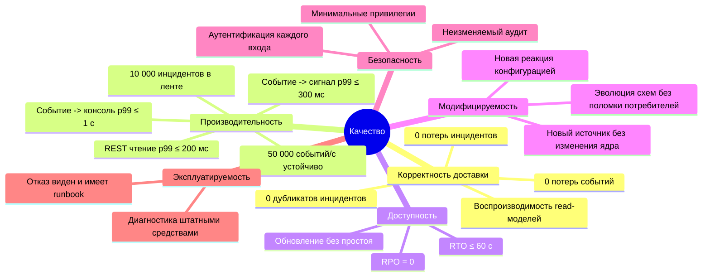

# Требования к качеству и бюджет задержек

Версия 0.1 · Шаг плана 0.3 · Статус: черновик

Раздел 10 arc42. Цели качества - в [README](README.md#12-цели-качества); исходные SLO - разделы 1.3 и 1.4 [плана](../psim-mvp-development-plan.md#13-нефункциональные-цели-slo-mvp). Методы проверки детализирует стратегия качества (шаг 0.7).

---

## 1. Дерево качества

## 2. Сценарии качества

Формат: источник -> стимул -> окружение -> реакция -> мера.

### 2.1 Корректность и доступность

| ID | Стимул и окружение | Реакция | Мера |
|---|---|---|---|
| QS-A1 | Экземпляр Correlation Engine падает посреди транзакции при `LOAD-50K` | Партиции переназначаются, состояние восстанавливается из changelog, обработка продолжается с зафиксированного смещения | 0 потерянных и 0 дублированных сигналов; восстановление ≤ 30 с |
| QS-A2 | Connector Gateway падает после записи пакета в Kafka, до подтверждения коннектору | SDK переподключается и досылает пакет; Normalizer отсекает дубликаты | 0 потерь, 0 дубликатов в `psim.events.normalized.v1` |
| QS-A3 | Incident Service получает тот же сигнал повторно (повтор после падения) | Inbox отбрасывает повтор | Число инцидентов равно эталонному |
| QS-A4 | Коннектор теряет связь на 10 мин при штатной нагрузке источника | SDK буферизует на диске и досылает после восстановления | 0 потерь; доставка буфера ≤ 2 мин после восстановления связи |
| QS-A5 | Отказывает любой один узел кластера под `LOAD-50K` | Kafka выбирает новых лидеров, PostgreSQL переключается на синхронную реплику, сервисы перераспределяют партиции | RTO ≤ 60 с, RPO = 0 |
| QS-A6 | Проекции удалены | Проекции перестраиваются проигрыванием Kafka | Результат идентичен рабочему |

### 2.2 Производительность

| ID | Стимул и окружение | Реакция | Мера |
|---|---|---|---|
| QS-P1 | `LOAD-50K` в течение 24 ч | Конвейер обрабатывает поток без роста лага | Лаг потребителей не растёт; SLO задержек соблюдены |
| QS-P2 | Событие, завершающее правило `conjunction`, при `LOAD-50K` | Сигнал публикуется | Событие -> сигнал p99 ≤ 300 мс |
| QS-P3 | Новый инцидент при `LOAD-50K` и 500 открытых консолях | Инцидент доставлен и отрисован | Событие -> консоль p99 ≤ 1 с |
| QS-P4 | Пик ×1,5 (75 000 событий/с) 10 мин | Задержка растёт в пределах бюджета, лаг рассасывается после пика | Лаг возвращается к норме ≤ 5 мин после пика; 0 потерь |
| QS-P5 | Оператор открывает карточку инцидента | REST-запрос обслуживается | p99 ≤ 200 мс |
| QS-P6 | В ленте 10 000 активных инцидентов | Прокрутка и фильтрация | ≥ 50 кадров/с |

### 2.3 Модифицируемость

| ID | Стимул и окружение | Реакция | Мера |
|---|---|---|---|
| QS-M1 | Интегратор подключает новый тип оборудования | Коннектор на SDK и правила отображения | 0 изменений кода и образов ядра |
| QS-M2 | Администратор добавляет новое правило корреляции | Правило проходит валидацию, пробный прогон и активируется | Без перезапуска сервисов; применяется атомарно |
| QS-M3 | Разработчик добавляет необязательное поле в схему события | CI проверяет совместимость | Старые потребители работают без изменений |

### 2.4 Безопасность

| ID | Стимул и окружение | Реакция | Мера |
|---|---|---|---|
| QS-S1 | Коннектор с отозванным сертификатом подключается | Отказ на рукопожатии или регистрации | Сессия не открывается; запись аудита |
| QS-S2 | Оператор запрашивает инцидент чужой площадки через API | Отказ по ABAC | `403`; запись аудита `AccessDenied` |
| QS-S3 | Запись аудита изменена в базе данных | Проверка целостности | Нарушение обнаружено с точностью до записи |

### 2.5 Эксплуатируемость

| ID | Стимул и окружение | Реакция | Мера |
|---|---|---|---|
| QS-O1 | Обновление N -> N+1 в кластере под `LOAD-50K` | Последовательная замена экземпляров, миграции expand/contract | Нет интервала > 5 с без новых сигналов; SLO задержек соблюдены |
| QS-O2 | Любой отказ из плана хаос-тестов | Отказ виден на дашборде | Алерт со ссылкой на runbook ≤ 2 мин |
| QS-O3 | Инцидент поддержки | Сбор диагностического пакета CLI | Одна команда; пакет без секретов |

---

## 3. Разложение SLO по компонентам

| SLO (план 1.3) | Вклад компонентов | Механизм | Проверка |
|---|---|---|---|
| 50 000 событий/с, пик ×1,5 | Каждый сервис горячего пути при числе экземпляров из [scaling.md](scaling.md#53-экземпляры-сервисов-при-50-000-событийс) выдерживает ≥ 1,5 × свою долю; Kafka ≥ 75 000 записей/с на топик | Партиционирование, пакетная обработка | Нагрузочные тесты 4.2, 4.5, 5.2; 10.1 |
| Событие -> сигнал p99 ≤ 300 мс | SDK + сеть 15, шлюз 25, Normalizer 30, Correlation 100, резерв 130 | Раздел 4 | Гистограммы по этапам; 10.1 |
| Событие -> консоль p99 ≤ 1 с | До сигнала 170, Incident 50, outbox 30, realtime 200, отрисовка 50, резерв 500 | Раздел 4 | Playwright с замером по event time; 10.1 |
| REST чтение p99 ≤ 200 мс | API Gateway 15, сервис или проекция 120, сеть и сериализация 30, резерв 35 | Чтение из Redis и индексированного PostgreSQL | Нагрузочный тест API |
| 0 потерь событий | SDK: буфер на диске; шлюз: подтверждение после `acks=all`; Normalizer, Correlation: EOS-K; Kafka: RF 3, `min.insync.replicas` 2 | [data-flows.md](data-flows.md#2-классы-семантики) | Сквозная сверка `source_seq`; SIM; CHAOS |
| 0 потерь инцидентов | Incident Service: коммит до фиксации смещения; PostgreSQL: синхронная реплика; outbox | EOS-DB, outbox | SIM; CHAOS |
| 0 дубликатов инцидентов | Детерминированный `signal_id`; inbox; уникальный открытый `grouping_key` (I3); ключ `psim.signals.v1` = `grouping_key` | [aggregates.md](../domain/aggregates.md#42-агрегат-incident) | SIM 10 000 прогонов |
| RTO ≤ 60 с | Обнаружение отказа 10 (`session.timeout.ms`); ребалансировка 5; восстановление состояния корреляции ≤ 30; переключение PostgreSQL ≤ 30 (параллельно); резерв 15 | Статическое членство, кооперативная ребалансировка, Patroni | CHAOS 10.2 |
| RPO = 0 | Kafka `acks=all` + `min.insync.replicas=2`; PostgreSQL синхронная репликация | - | CHAOS 10.2 |
| Обновление без простоя | Совместимость схем N ↔ N+1; expand/contract; последовательная замена с дренированием; статическое членство | [deployment.md](deployment.md#4-обновление) | S12 |
| 10 000 инцидентов в ленте | Projection: снимок ленты одним запросом; клиент: виртуализация, дельты по WebSocket | - | Playwright, 8.3 |

---

## 4. Бюджет задержек

Задержка измеряется от `occurred_at` события (время у источника). Значения - p99 в миллисекундах. Сумма p99 этапов - консервативная оценка сверху: p99 суммы меньше суммы p99.

### 4.1 Событие -> сигнал (≤ 300 мс)

| Этап | Участок | Бюджет | Что входит |
|---|---|---|---|
| B1 | Коннектор -> шлюз | 15 | Накопление пакета в SDK (`linger` 5 мс), сеть, gRPC |
| B2 | Шлюз -> `psim.ingest.raw.v1` | 25 | Валидация, запись с `acks=all` |
| B3 | Normalizer | 30 | Чтение, отображение, обогащение, транзакция и её видимость для `read_committed` |
| B4 | Correlation Engine | 100 | Чтение, вычисление правил, запись состояния, транзакция (интервал коммита ≤ 50 мс) |
| | **Итого** | **170** | Резерв 130 |

Для правил с перераспределением (ключ шире зоны) добавляется этап B4' - 100 мс; итог 270 мс, в пределах SLO. Для правил `threshold` и `absence` задержка отсчитывается от момента закрытия окна по водяному знаку, а не от события.

### 4.2 Событие -> инцидент в консоли (≤ 1 000 мс)

| Этап | Участок | Бюджет | Что входит |
|---|---|---|---|
| B1-B4 | До сигнала | 170 | См. 4.1 |
| B5 | Incident Service | 50 | Чтение сигнала, транзакция PostgreSQL: inbox, агрегат, outbox |
| B6 | Outbox relay | 30 | Пробуждение по `LISTEN/NOTIFY`, публикация |
| B7 | API Gateway realtime | 150 | Чтение `psim.incidents.events.v1`, фильтр ABAC, отправка в WebSocket |
| B8 | Сеть до браузера | 50 | - |
| B9 | Отрисовка в браузере | 50 | Применение дельты, отрисовка строки ленты, звук |
| | **Итого** | **500** | Резерв 500 |

Проекции не стоят на пути инцидента в консоль: клиент получает снимок ленты из Projection Service вместе со смещениями, на которых снимок согласован, и далее получает дельты из Kafka через realtime-канал с этих смещений ([crosscutting.md](crosscutting.md#9-realtime-снимок-и-дельты)).

### 4.3 Прочие бюджеты

| Путь | SLO | Разложение |
|---|---|---|
| Команда: запрос -> доставка коннектору | ≤ 200 мс | API Gateway 10, Command Service 20, outbox 30, шлюз читает команду 30, доставка в сессию 20; итого 110, резерв 90 |
| Изменение каталога -> потребители | ≤ 2 с | Outbox 30, чтение и применение копии 100; итого 130 |
| Срабатывание таймера SLA | ≤ 1 с погрешности | Интервал опроса таймеров 200 мс, обработка 100 |
| Сигнал -> обработка Incident Service | ≤ 50 мс | B5 |
| Изменение агрегата -> проекция | ≤ 100 мс | Outbox 30, Projection 70 |

### 4.4 Как измеряется

- Каждый этап добавляет в заголовки Kafka метку времени `psim-ts-<stage>` и пишет гистограмму `psim_stage_latency_seconds{stage}` (от входа до выхода этапа) и `psim_e2e_latency_seconds{stage}` (от `occurred_at` до выхода этапа).
- Браузер в тестовом режиме сообщает время отрисовки инцидента; Playwright сопоставляет его с `occurred_at`.
- Часы узлов синхронизированы (chrony); рассогласование контролируется метрикой и входит в погрешность.
- Регрессия задержки этапа больше 5% против базовой линии блокирует слияние (барьер шага 10.1, базовая линия - шаг 3.1).
