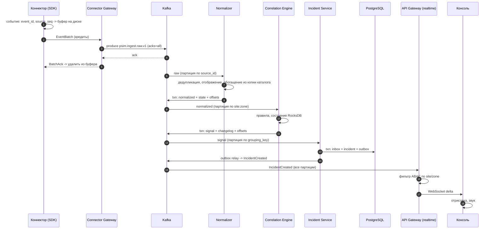
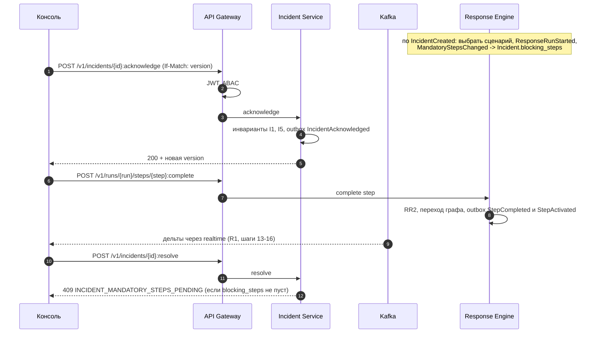
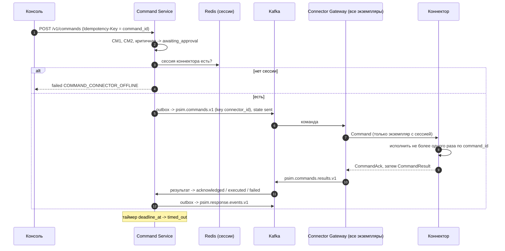
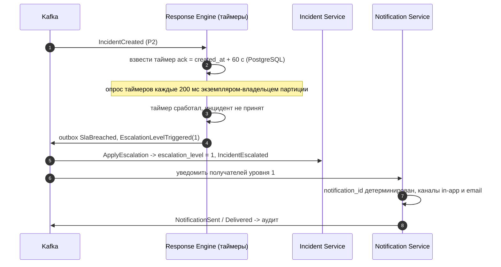
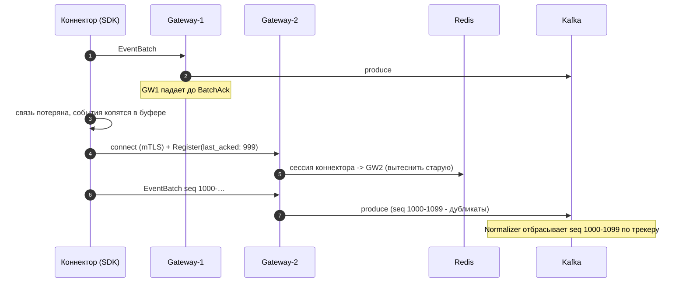
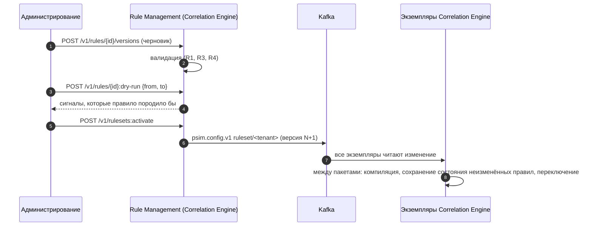

# Представление времени выполнения

Версия 0.1 · Шаг плана 0.3 · Статус: черновик

Раздел 6 arc42. Ключевые сценарии взаимодействия компонентов. Номера этапов B1-B9 - из [бюджета задержек](quality.md#4-бюджет-задержек).

---

## R1. Событие -> инцидент в консоли (S3-S6)

## R2. Принятие инцидента и сценарий (S7)

`blocking_steps` обновляется в Incident Service по событиям Response в конечном счёте. Чтобы исключить решение инцидента, пока событие о новом обязательном шаге ещё в пути, Response Engine публикует `MandatoryStepsChanged` в той же транзакции, что и активацию шага; Incident Service при `resolve` дополнительно проверяет, что применил события запуска до версии, известной клиенту (клиент передаёт её в запросе).

## R3. Команда на устройство (S8)

## R4. Эскалация по SLA (S9)

## R5. Переподключение коннектора после обрыва (S11)

## R6. Активация набора правил (S4)

## R7. Отказ экземпляра Correlation Engine (S11, QS-A1)

1. Экземпляр перестаёт отвечать; брокер исключает его из группы через `session.timeout.ms` (10 с).
2. Кооперативная ребалансировка передаёт его партиции оставшимся экземплярам.
3. Новый владелец инициализирует транзакционный продюсер с тем же `transactional.id` - незавершённые транзакции старого владельца прерываются брокером.
4. Состояние партиции восстанавливается из `psim.correlation.changelog.v1` в локальный RocksDB (≤ 30 с).
5. Чтение продолжается с зафиксированного смещения; сигналы, опубликованные в прерванной транзакции, невидимы для `read_committed`-потребителей и будут опубликованы повторно с теми же `signal_id`.
