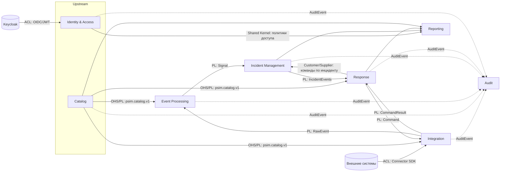

# Bounded contexts и карта контекстов

Версия 0.1 · Шаг плана 0.2 · Статус: черновик

## 1. Контексты

| Контекст | Ответственность | Сервисы | Владеет данными |
|---|---|---|---|
| **Integration** | Подключение коннекторов, приём сырых событий, доставка команд коннекторам | Connector SDK, Connector Gateway | Сессии коннекторов (Redis) |
| **Catalog** | Модель защищаемых объектов, устройств, источников, коннекторов | Resource Catalog | Локации, устройства, источники, типы, коннекторы, планы |
| **Event Processing** | Нормализация, обогащение, хранение значимых событий, корреляция, правила | Normalizer, Event History, Correlation Engine, управление правилами | Правила отображения, правила корреляции, наборы правил, состояние корреляции, значимые события |
| **Incident Management** | Жизненный цикл инцидентов, группировка сигналов, назначение, хронология | Incident Service | Инциденты, типы инцидентов |
| **Response** | Сценарии реагирования, команды на устройства, SLA, эскалации, уведомления | Response Engine, Command Service, Notification Service | Сценарии, запуски, команды, политики эскалации, уведомления, таймеры |
| **Identity & Access** | Пользователи, роли, области доступа, решения о доступе | Keycloak, библиотека политик, API Gateway | Назначения ролей и областей доступа |
| **Audit** | Неизменяемый журнал действий | Audit Service | Записи аудита, контрольные точки |
| **Reporting** | Read-модели консоли и отчёты | Projection Service, API отчётов | Проекции (восстановимы из Kafka) |
| **Platform** | Общие механизмы: конверт, конфигурация, наблюдаемость, DLQ | Runtime, библиотеки, CLI | Конфигурация системы, retention |

## 2. Карта контекстов

Обозначения: **PL** - Published Language (версионируемая схема Protobuf в топике); **OHS** - Open Host Service; **ACL** - Anti-Corruption Layer; **Customer/Supplier** - нижестоящий контекст влияет на контракт вышестоящего; **Shared Kernel** - общая библиотека.

## 3. Отношения

| Вышестоящий -> нижестоящий | Тип | Канал | Примечание |
|---|---|---|---|
| Внешние системы -> Integration | ACL | Connector SDK, gRPC | Модель внешнего оборудования переводится в `RawEvent` в коннекторе, ядро не знает о производителях |
| Integration -> Event Processing | PL | `psim.ingest.raw.v1` | Integration не интерпретирует содержимое события, только проверяет схему и права |
| Catalog -> Event Processing, Integration, Response | OHS + PL | `psim.catalog.v1` (compacted) | Потребители держат локальную копию каталога и не обращаются к Catalog синхронно на горячем пути |
| Event Processing -> Incident Management | PL | `psim.signals.v1` | Incident не знает правил; сигнал самодостаточен: тип инцидента, приоритет, ключ группировки |
| Incident Management -> Response | PL | `psim.incidents.events.v1` | Response запускает сценарии и таймеры SLA по событиям инцидента |
| Response -> Incident Management | Customer/Supplier | `psim.response.events.v1` | Incident учитывает незавершённые обязательные шаги при решении и отражает шаги в хронологии |
| Response -> Integration | PL | `psim.commands.v1`, `psim.commands.results.v1` | Command Service владеет жизненным циклом команды, шлюз только доставляет её в сессию |
| Keycloak -> Identity & Access | ACL | OIDC, JWKS | Роли и области доступа приводятся к внутренней модели `Principal` |
| Все -> Audit | Conformist (Audit подстраивается) | `psim.audit.v1` | Каждый контекст публикует записи аудита в общем формате; Audit их не интерпретирует |
| Все -> Reporting | Conformist | топики домена | Проекции восстанавливаются проигрыванием топиков |
| Platform -> все | Shared Kernel | библиотеки | Конверт, runtime, ошибки, наблюдаемость, абстракция времени |

## 4. Правила границ

1. Контекст изменяет только свои данные. Чужие данные доступны ему как локальная копия из топика или через запрос к API владельца вне горячего пути.
2. Межконтекстное взаимодействие на горячем пути - только через Kafka. Синхронные вызовы допускаются для операций пользователя (REST через API Gateway) и для чтения справочных данных вне горячего пути.
3. Доменное ядро каждого контекста - библиотека без зависимостей от Kafka, PostgreSQL, Redis, сети и системных часов. Проверяется fitness function (шаг 1.2).
4. Идентификаторы чужих агрегатов хранятся как значения; ссылки на чужие объекты не разыменовываются внутри транзакции.
5. Контракты между контекстами (схемы Protobuf) - публичные версионируемые артефакты в каталоге `contracts/` (шаг 0.5).

## 5. Точки расширения для ИИ (ADR-025)

Вне MVP, но заложены в границы:

- **Потребитель топиков** - новый контекст читает `psim.events.normalized.v1` или `psim.signals.v1` и публикует свои сигналы в `psim.signals.v1` как ещё одно «правило».
- **Шаг сценария** - тип шага `automated` вызывает внешний обработчик через webhook и получает рекомендацию.
- **Ассистент оператора** - потребитель проекций и API с ролью только для чтения.
