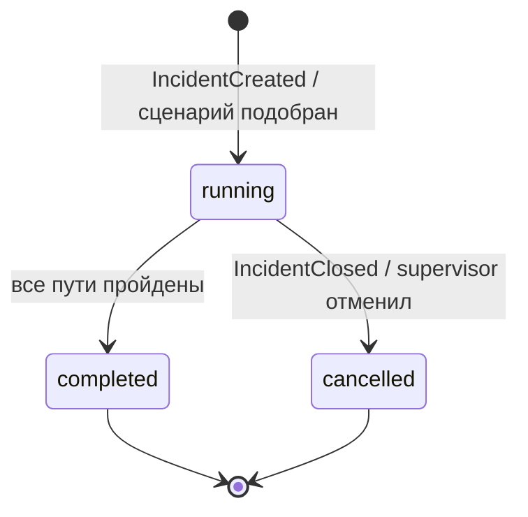
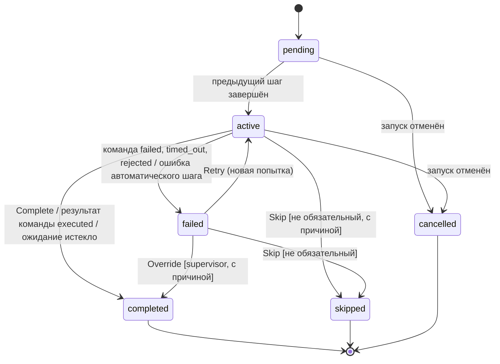
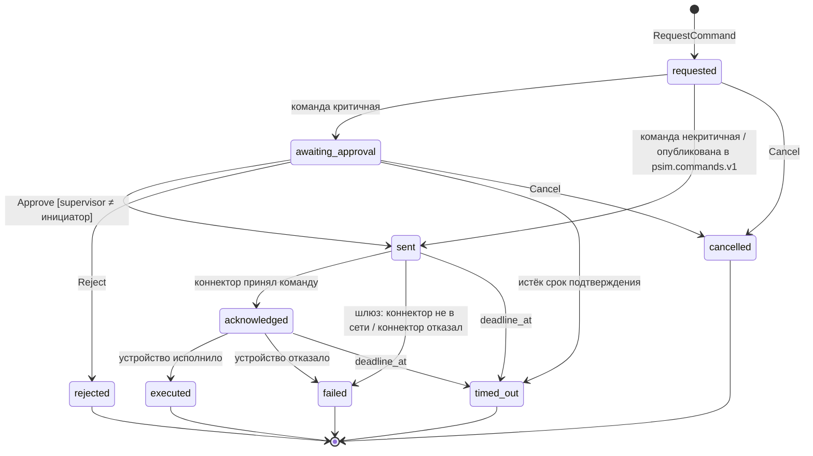
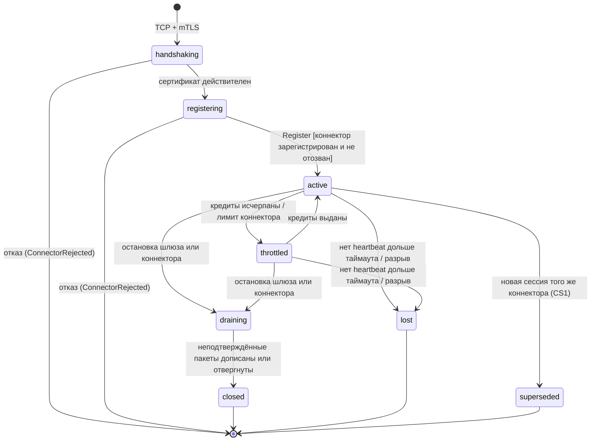
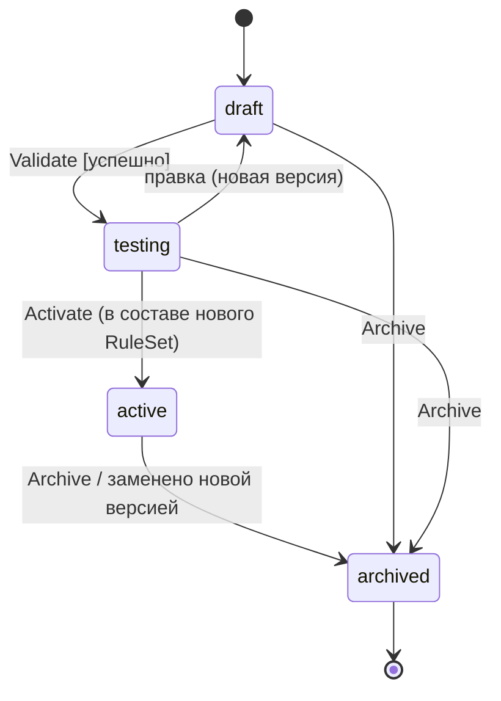

# Модели состояний

Версия 0.1 · Шаг плана 0.2 · Статус: черновик

Диаграммы в формате Mermaid. Переход вне диаграммы отклоняется доменным ядром с кодом `INCIDENT_INVALID_STATE_TRANSITION`, `COMMAND_INVALID_STATE` или аналогичным кодом контекста из [каталога ошибок](../../contracts/errors/errors.yaml). Каждый переход порождает доменное событие из [aggregates.md](aggregates.md) и запись аудита.

---

## 1. Инцидент

```mermaid
stateDiagram-v2
    [*] --> new : IngestSignal (новый grouping_key)
    new --> acknowledged : Acknowledge
    acknowledged --> in_progress : StartWork / первое действие по сценарию
    new --> resolved : Resolve [supervisor; false_alarm, duplicate, test]
    acknowledged --> resolved : Resolve [blocking_steps пуст]
    in_progress --> resolved : Resolve [blocking_steps пуст]
    resolved --> in_progress : Reopen
    resolved --> closed : Close [таймер авто-закрытия или supervisor]
    closed --> [*]
```

| Из | Действие | В | Кто | Условия |
|---|---|---|---|---|
| - | `IngestSignal` | `new` | система | Нет открытого инцидента с этим `grouping_key` или окно группировки истекло (I3, I4) |
| `new`, `acknowledged`, `in_progress` | `IngestSignal` | без изменений | система | Сигнал присоединён, приоритет пересчитан (I6) |
| `new` | `Acknowledge` | `acknowledged` | operator, supervisor | Принявший становится ответственным; область доступа включает зону (I5) |
| `acknowledged` | `StartWork` | `in_progress` | ответственный | Явно или автоматически при первом выполненном шаге сценария или первой команде |
| любое открытое | `Assign`, `Reassign` | без изменений | supervisor; operator - только себе | Новый ответственный соответствует I5 |
| `new` | `Resolve` | `resolved` | supervisor | Только с решением `false_alarm`, `duplicate` или `test` - для массовых ложных срабатываний |
| `acknowledged`, `in_progress` | `Resolve` | `resolved` | ответственный, supervisor | `blocking_steps` пуст (I7) |
| `resolved` | `Reopen` | `in_progress` | ответственный, supervisor | До закрытия (I10) |
| `resolved` | `Close` | `closed` | система по таймеру, supervisor | Конечное состояние (I8) |

**Эскалация** - ортогональный признак `escalation_level`, а не состояние. Она возможна в `new`, `acknowledged` и `in_progress` и не меняет состояния. В интерфейсе эскалированный инцидент отображается с отдельной меткой.

**«Ложный»** - это значение решения `resolution = false_alarm`, а не отдельное состояние. Это сохраняет единый путь к закрытию и упрощает метрики: доля ложных тревог считается по решению.

Оба отличия от формулировки плана (шаг 5.3, где «эскалирован» и «ложный» перечислены как состояния) зафиксированы в [ADR-027](../adr/0027-incident-states.md).

---

## 2. Запуск сценария

### 2.1 Запуск

Если ни один сценарий не подходит под инцидент, запуск не создаётся; при `IncidentType.response_required = true` в хронологию записывается предупреждение, а в метриках учитывается инцидент без сценария.

### 2.2 Шаг

- Шаг `decision` завершается выбором варианта; активируется шаг выбранной ветки, шаги остальных веток не активируются и в отчёте считаются непройденными.
- Шаги `notify`, `escalate`, `automated` и `wait` выполняются системой без участия оператора.
- Обязательный шаг в `failed` не даёт решить инцидент, пока его не повторят успешно или `supervisor` не завершит его с причиной (`Override`).

---

## 3. Команда

| Состояние | Смысл |
|---|---|
| `requested` | Запрос принят и авторизован (CM1, CM2) |
| `awaiting_approval` | Ждёт подтверждения вторым пользователем (CM3) |
| `sent` | Записана в `psim.commands.v1`; шлюз доставляет её в сессию коннектора |
| `acknowledged` | Коннектор подтвердил получение |
| `executed` | Коннектор сообщил об успешном исполнении устройством |
| `failed`, `rejected`, `timed_out`, `cancelled` | Финальные неуспешные состояния с причиной |

Повторная доставка в коннектор с тем же `command_id` допустима: коннектор (SDK) обязан исполнять команду не более одного раза и возвращать сохранённый результат.

---

## 4. Сессия коннектора

- При переходе в `lost` или `superseded` неподтверждённые пакеты считаются непринятыми; SDK досылает их из буфера в новой сессии, дубликаты отсекаются по `event_id` и `source_seq`.
- Команды, которые не удалось доставить из-за отсутствия сессии, получают результат `failed` с причиной `COMMAND_CONNECTOR_OFFLINE`; повторную доставку при восстановлении сессии в MVP не выполняем, чтобы исключить исполнение устаревших команд.

---

## 5. Правило корреляции

В состоянии `testing` доступен пробный прогон на исторических данных; сигналы пробного прогона не публикуются в `psim.signals.v1`.

---

## 6. Уведомление

```mermaid
stateDiagram-v2
    [*] --> pending
    pending --> sent : передано каналу
    sent --> delivered : канал подтвердил (in-app: клиент получил; webhook: 2xx)
    sent --> pending : временная ошибка, повтор
    pending --> failed : попытки исчерпаны
    sent --> failed : постоянная ошибка
    pending --> aggregated : включено в сводку
    delivered --> [*]
    failed --> [*]
    aggregated --> [*]
```

Для email состояние `delivered` означает приём SMTP-сервером: подтверждения доставки получателю в MVP нет.
