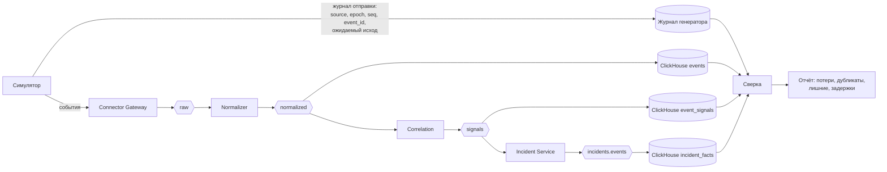

# Методика сквозной сверки потерь и дубликатов

Версия 0.1 · Шаг плана 0.7 · Статус: черновик

Цель: доказать «0 потерянных событий, 0 потерянных инцидентов, 0 дубликатов инцидентов» (план 1.3) в нагрузочных и хаос-тестах, а не предполагать это. Реализация - шаги 3.1 (базовая версия), 4.3 (симулятор), 10.1, 10.2.

---

## 1. Идея

Генератор нагрузки знает, что отправил; платформа сохраняет, что приняла и что из этого получилось. Сверка сравнивает два множества по уникальным ключам, которые платформа обязана сохранить неизменными по всему конвейеру.

## 2. Ключи сверки

| Уровень | Ключ | Источник ожидаемого | Источник фактического |
|---|---|---|---|
| События | `(source_id, source_epoch, source_seq)` и `event_id` | Журнал генератора: каждое событие с подтверждённой отправкой (`BatchAck`) и каждое событие в буфере SDK на момент окончания теста | ClickHouse `events` (все события, ADR-028) и, для контроля, чтение `psim.events.normalized.v1` |
| Сигналы | `signal_id` (детерминирован, ADR-005) | Оракул сценариев: генератор порождает события по сценариям с известным результатом корреляции | `psim.signals.v1`, ClickHouse `event_signals` |
| Инциденты | `grouping_key` + окно | Оракул сценариев | `psim.incidents.events.v1`, ClickHouse `incident_facts`, PostgreSQL Incident Service |

Журнал генератора - файл или таблица ClickHouse `loadgen_ledger`, отдельная от данных платформы, чтобы сверка не зависела от проверяемой системы.

## 3. Оракул сценариев

Фоновая нагрузка (`LOAD-50K`) состоит из событий, которые не порождают сигналов, и из **сценарных вставок** с известным результатом:

| Вставка | Ожидаемый результат |
|---|---|
| Пара «периметр + видеоаналитика» в одной зоне в пределах окна | 1 сигнал, 1 инцидент |
| Та же пара с интервалом больше окна | 0 сигналов |
| Повтор пары в окне группировки | 1 инцидент с 2 сигналами |
| Пороговая серия N событий | 1 сигнал |
| Отсутствие ожидаемого heartbeat | 1 сигнал после закрытия окна |
| Поздние события в пределах допустимого опоздания | Учтены |
| Поздние события сверх допустимого опоздания | Не учтены, посчитаны в метрике |

Оракул вычисляет ожидаемые сигналы и инциденты теми же правилами в эталонной однопоточной реализации доменного ядра без инфраструктуры (тот же код домена, другой адаптер), поэтому ожидания не зависят от партиционирования и сбоев.

## 4. Алгоритм

1. **Подготовка.** Чистое состояние или зафиксированная отметка времени начала; генератор записывает зерно, профиль, список вставок.
2. **Прогон.** Нагрузка и, для хаос-тестов, внесение сбоев по сценарию эксперимента.
3. **Дренирование.** Генератор останавливается; ожидание, пока лаг всех групп потребителей станет 0 и буферы SDK пусты, но не дольше дедлайна (по умолчанию 10 мин).
4. **Сверка событий.** Для каждого источника: множество отправленных номеров минус принятые = потерянные; принятые с кратностью больше 1 = дубликаты; принятые, но не отправленные = лишние.
5. **Сверка сигналов и инцидентов.** Сравнение с оракулом по `signal_id` и по `grouping_key`; инцидент с тем же `grouping_key` в одном окне более одного раза - дубликат.
6. **Отчёт.** Количество и примеры по каждой категории; распределение задержек (по [latency-measurement.md](latency-measurement.md)); список внесённых сбоев с временем.

## 5. Критерии

| Категория | Порог |
|---|---|
| Потерянные события | 0 |
| Дубликаты событий в `psim.events.normalized.v1` | 0 (EOS-K, ADR-006) |
| Лишние события | 0 |
| Потерянные сигналы и инциденты | 0 |
| Дубликаты инцидентов | 0 |
| События, отброшенные политикой переполнения SDK | Допустимы только класса `info`, только при сценарии переполнения, и каждое отражено в метрике `system.connector.buffer_overflow` |

Любое нарушение - провал теста; отчёт сохраняет данные для воспроизведения (зерно, время сбоев, диапазоны смещений).

## 6. Сверка в симуляции

В симуляционном стенде (шаг 2.7) тот же алгоритм выполняется в памяти после каждого прогона: тысячи прогонов с разными зёрнами и расписаниями сбоев. Это основной способ доказательства корректности; сверка на стендах подтверждает её на реальной инфраструктуре.
