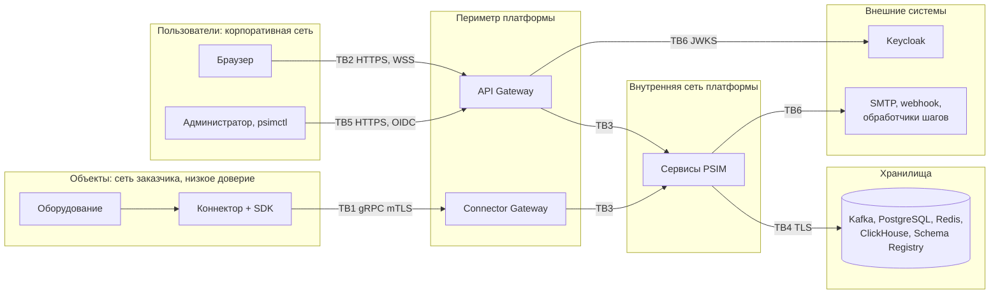

# Модель угроз PSIM Platform

Версия 0.1 · Шаг плана 0.6 · Статус: черновик

Документ описывает методику, активы, границы доверия и допущения. Реестр угроз и требований безопасности ведётся в [threat-model.yaml](threat-model.yaml) (источник истины), таблицы для чтения - [threat-register.md](threat-register.md) (генерируется задачей `task docs:threats:gen`). Задача `task docs:threats` проверяет, что каждая угроза высокого уровня закрыта мерой, а каждая мера назначена существующему шагу плана (DoD шага 0.6).

---

## 1. Методика

1. **Декомпозиция** - система разбита на границы доверия (раздел 4) по архитектуре ([README](../architecture/README.md), [deployment.md](../architecture/deployment.md)).
2. **STRIDE** на каждой границе: Spoofing (подмена), Tampering (изменение), Repudiation (отказ от действий), Information disclosure (раскрытие), Denial of service (отказ в обслуживании), Elevation of privilege (повышение привилегий).
3. **Оценка риска** = вероятность × ущерб, каждая по шкале 1-3:

| Риск | Значение | Требование |
|---|---|---|
| Высокий | 6-9 | Обязательна мера с шагом плана; проверка в шаге 10.3 |
| Средний | 3-4 | Мера с шагом плана или обоснованное принятие риска |
| Низкий | 1-2 | Допускается принятие риска с записью в реестре |

   Ущерб 3 - угроза жизни и здоровью (пропущенная тревога), несанкционированное физическое воздействие (открытие дверей), компрометация всей установки. Ущерб 2 - утечка персональных данных, нарушение работы части объектов, нарушение доказуемости аудита. Ущерб 1 - локальное неудобство без последствий для безопасности объекта.

4. **Меры** оформляются как требования безопасности `SR-NN` с областью, шагами плана и способом проверки. Одна мера закрывает несколько угроз.
5. **Пересмотр** - при каждом ADR, затрагивающем границы доверия, и на шаге 10.3 (внутренний пентест по модели угроз).

## 2. Контекст и особенности домена

PSIM управляет физической безопасностью: ошибки и атаки приводят не только к утечке данных, но и к **пропуску тревоги** (пожар, проникновение) и к **несанкционированному физическому воздействию** через команды устройствам (разблокировка дверей, снятие с охраны). Поэтому целостность и доступность конвейера тревог и авторизация команд имеют наивысший приоритет, выше конфиденциальности.

## 3. Активы

| ID | Актив | Свойства | Почему важен |
|---|---|---|---|
| A1 | Поток событий, сигналы, инциденты | Целостность, доступность | Подмена или потеря - пропущенная или ложная тревога |
| A2 | Команды устройствам | Целостность, авторизация | Физическое воздействие на объект |
| A3 | Журнал аудита | Целостность, доступность | Доказательная база расследований (S10) |
| A4 | Конфигурация: правила корреляции и отображения, сценарии, каталог, политики эскалации | Целостность | Изменение правил может «выключить» реакцию на угрозу |
| A5 | Ключи и секреты: сертификаты коннекторов, внутренний УЦ, ключ подписи контрольных точек аудита, учётные данные сервисов | Конфиденциальность, целостность | Компрометация даёт доступ ко всей установке |
| A6 | Учётные записи и сессии пользователей | Конфиденциальность, целостность | Действия от имени оператора или администратора |
| A7 | Доступность платформы | Доступность | Время реакции на тревогу (SLO событие -> консоль ≤ 1 с) |
| A8 | Персональные данные: идентификаторы карт и владельцев (СКУД), данные операторов, ссылки на видео | Конфиденциальность | Требования законодательства о персональных данных заказчика |

## 4. Границы доверия

| ID | Граница | Кто по ту сторону | Основные угрозы |
|---|---|---|---|
| TB1 | Коннектор -> Connector Gateway | Коннекторы интеграторов в сетях объектов; узел коннектора может быть скомпрометирован | Подмена коннектора, ложные события, перегрузка, разбор вредоносных сообщений |
| TB2 | Браузер -> API Gateway | Операторы, старшие смены, аудиторы, руководители | Кража учётных данных и токенов, XSS, обход авторизации, злоупотребление командами |
| TB3 | Сервис <-> сервис | Процессы платформы во внутренней сети | Подмена сервиса, несанкционированная запись в топики |
| TB4 | Сервис -> хранилища | Kafka, PostgreSQL, Redis, ClickHouse, Schema Registry; администраторы инфраструктуры | Изменение аудита, инъекции, исчерпание дисков, открытые хранилища |
| TB5 | Администрирование | Администраторы платформы, инфраструктуры и ОС | Подавление правил, утечка секретов, неотслеживаемые изменения |
| TB6 | Платформа -> внешние системы | Keycloak, SMTP, получатели webhook, обработчики автоматических шагов | SSRF, подделка IdP, утечка данных в уведомлениях |
| TB7 | Цепочка поставки | Зависимости, сборка, образы, пакеты, установка у заказчика | Подмена зависимостей и артефактов |

## 5. Допущения и границы ответственности

1. **PSIM не заменяет сертифицированные системы пожарной сигнализации и пожаротушения.** Управление пожарной автоматикой остаётся за приёмно-контрольными приборами; PSIM отображает, коррелирует и организует реакцию. Это ограничивает ущерб от отказа платформы для пожарных сценариев.
2. Сеть платформы (Z2-Z4) выделена межсетевым экраном; во внутреннюю сеть нет прямого доступа из сетей объектов и пользователей ([deployment.md](../architecture/deployment.md#5-сетевые-порты)).
3. Узлы платформы администрирует доверенный персонал заказчика; угроза злонамеренного администратора ОС рассматривается в части аудита (обнаружение), а не предотвращения.
4. Безопасность оборудования и протоколов производителей до коннектора - вне границ PSIM; коннектор - граница, где внешний протокол переводится в протокол PSIM.
5. Keycloak и корпоративный IdP настраиваются по требованиям этого документа; их собственная защищённость - ответственность эксплуатации.
6. Сертификация не требуется (решение 0.1 плана); требования учитывают типовые меры защиты персональных данных, но не заменяют оценку соответствия у заказчика.

## 6. Сводка

Результаты анализа - в [threat-register.md](threat-register.md): угрозы по границам и категориям STRIDE, риски, меры и шаги плана. Ключевые решения, вытекающие из модели угроз:

- **Команды:** критичные команды - только с подтверждением вторым пользователем; коннектор не может инициировать команды; каждая команда в аудите.
- **Конфигурация реакции:** изменения правил, отображений, сценариев и политик - в аудите и с оповещением старшего смены при отключении правил для критичных типов инцидентов.
- **Многофакторная аутентификация** обязательна для ролей `admin` и `supervisor`.
- **Токены** - только в памяти браузера, срок жизни 5 минут, никогда в URL.
- **Исходящие вызовы** (webhook, автоматические шаги) - только по списку разрешённых адресов, внутренние диапазоны адресов запрещены по умолчанию.
- **Данные от коннекторов недоверенные** на всём пути до интерфейса: валидация на входе, экранирование при выводе.
- **Цепочка поставки:** зафиксированные версии и дайджесты образов, SBOM, подпись артефактов, проверка подписи установщиком.
